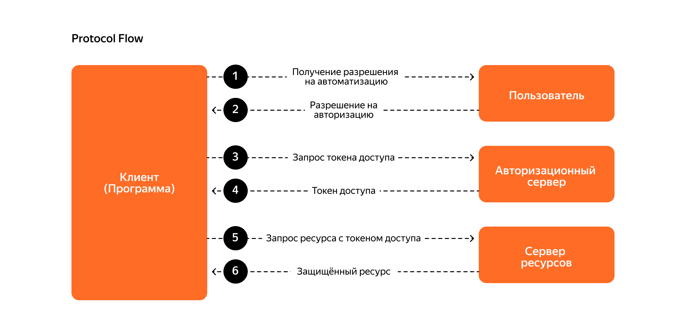

# Сервис авторизации

OAuth 2.0 Authorization Server, который работает по схеме Client Credentials Flow:

1. auth-service генерирует JWT-токены для клиентов
2. showcase-service (client) получает токен и использует его для доступа к payment-service
3. payment-service (resource server) проверяет токен и разрешает/запрещает доступ



## Подробное описание

1. Клиенты (showcase-client и payment-service) автоматически регистрируются в БД через OAuth2ClientInitializer
2. Когда showcase-service хочет обратиться к payment-service, он делает запрос к /oauth2/token в auth-service и получает токен с client_id, сроком действия и scopes
3. showcase-service использует токен для запросов к payment-service
4. payment-service проверяет токен: получает публичный ключ из http://localhost:9000/oauth2/jwks, проверяет подпись токена и scopes

## 🚀 Как запускать

### В Docker

#### Только продакшен
```
docker-compose --profile prod up -d auth-service
```
Сервис будет доступен по адресу: http://localhost:9000.

### Остановка контейнеров

Чтобы остановить все запущенные контейнеры, выполните:

```
docker-compose down
```

Если вы хотите также удалить тома (volumes), используйте:

```
docker-compose down -v
```

### Локально

1. Убедитесь, что у вас установлен PostgreSQL на порту 5432 

2. Соберите сервис:
```
mvn clean install -pl auth-service
```

3. Запустите сервис:
```
java -jar auth-service/target/auth-service.jar
```

Сервис будет доступен по адресу: http://localhost:9000
